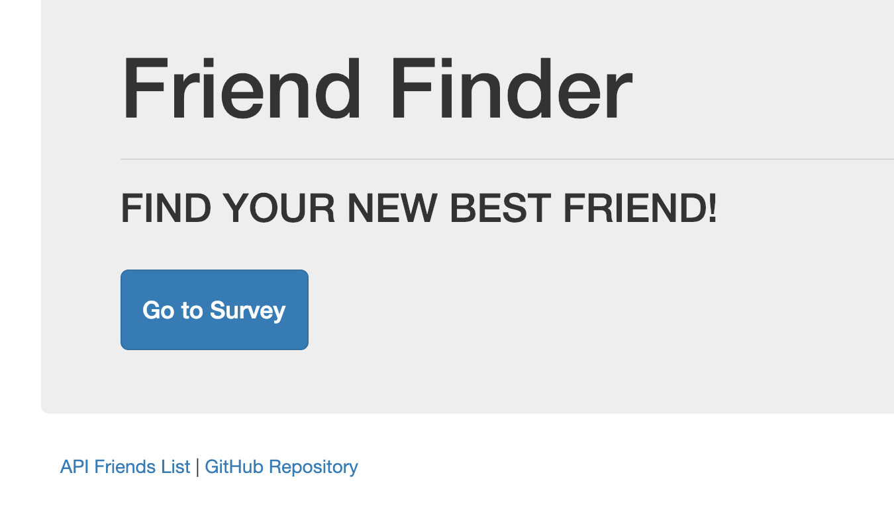
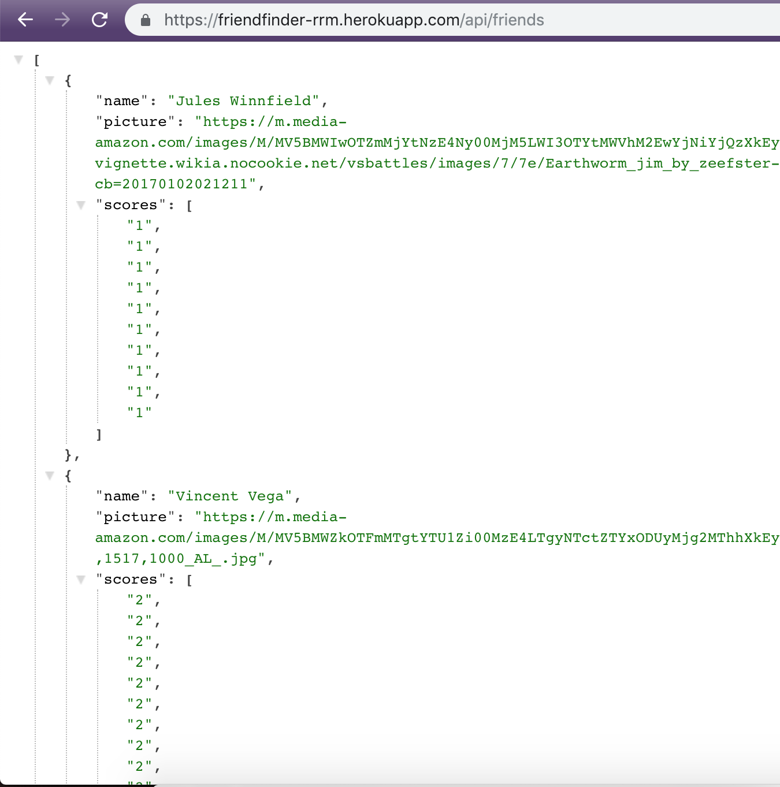
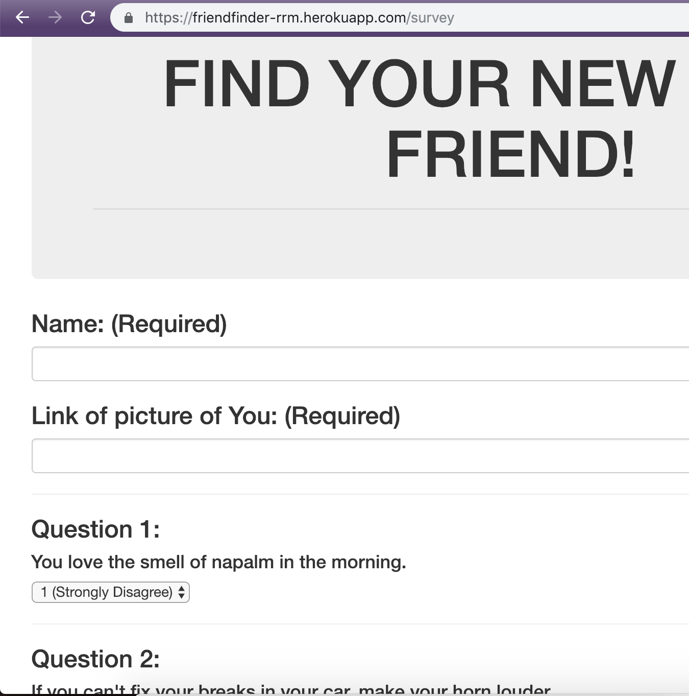
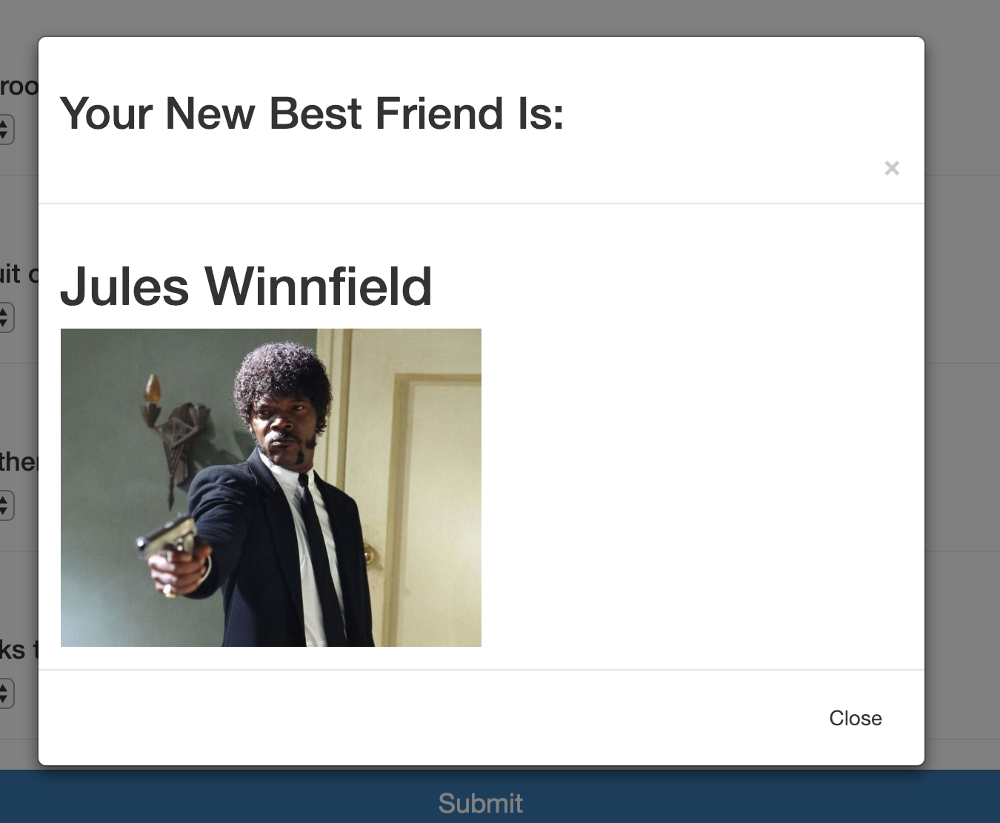
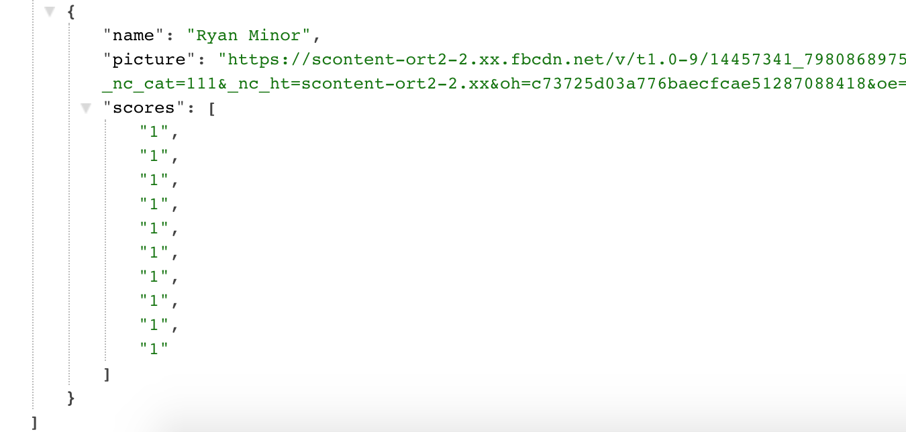

# Friend Finder

## Overview
This app is a compatibility-based "Friend Finder" application. This full-stack site takes in results from users' surveys, then compares the answers with those from other users. The app then displays the name and picture of the user with the best overall match.

To see the deployed version of this using heroku please go to: https://friendfinder-rrm.herokuapp.com/

You will use Express to handle routing. Make sure you deploy your app to Heroku so other users can fill it out.

## How to use Friend Finder
Upon going to the deployed link listed above you will see this screen: 

The user has a couple options. Starting with the bottom two links you can see all of the repositories on my github (FUN!) and you can look at the API data for this application. 
 
 
 

This is the API data which will make more sense when you take the survey. If you look at the URL it is at the '/API/friends' pathname which will also make sense if you read the psuedocode available in the github repository. 
 
 
 

Now for the fun part! This is the survey itself. You will enter your name in the first field and a link to a photo of yourself that exists as a URL anywhere on the internet. 

Then you will respond to all 10 of the questions with answers between one and five. One being that you strongly disagree and five being that you strongly agree. 

Once you have finished simply press the 'Submit' button at the bottom of the page.
 
 
 

When the form is sumbitted the backend will do its job and parse through the submitted data, convert it into JSON data and find the closest match to the existing data of 'friends'. 

A modal will pop up and display the name of the users closest matching friend as well as display a photo of them. 
 
 
 

Now if the user goes back to the API data they will see themselves in the JSON data with all of their corresponding answers to the questions! This will allow the API to incorporate more and more friends!

## Technologies Used:
* HTML/CSS
* Bootstrap
* JS
* Heroku
* nodeJS
* express
* path
* array-sort

To see this and other projects go to: https://ryanroyce.github.io/portfolio/